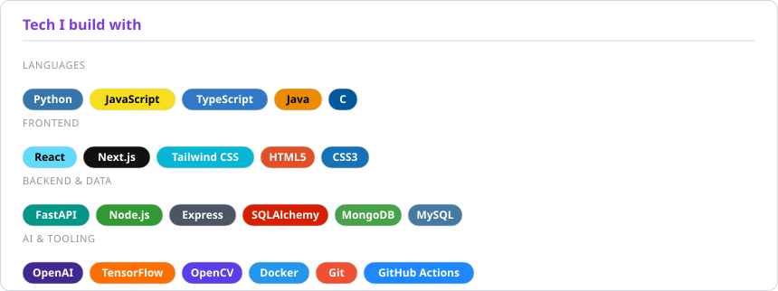
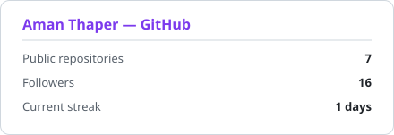
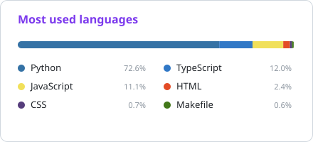

<div align="center">



<a href="https://www.linkedin.com/in/aman-thaper04"><b>LinkedIn</b></a>
&nbsp;·&nbsp;
<a href="mailto:work.aman04@gmail.com"><b>Email</b></a>
&nbsp;·&nbsp;
<a href="https://pypi.org/project/dracarys-dast/"><b>PyPI</b></a>
&nbsp;·&nbsp;
<a href="https://github.com/Aman-Thaper/dracarys"><b>DRACARYS</b></a>

</div>

---

## whoami

```console
$ whoami --verbose

  name     Aman Thaper
  role     Full-stack developer, currently deep in application security
  ships    DRACARYS — an autonomous DAST scanner (PyPI · GitHub Action · VS Code · MCP)
  stack    Python · JavaScript · React/Next · Node · FastAPI
  believes a vulnerability isn't real until you can prove it, and isn't fixed
           until the original exploit stops working
  ask me   about DAST, evidence-first tooling, or wiring LLMs into real products
```

---

## Featured — 🐉 [DRACARYS](https://github.com/Aman-Thaper/dracarys)

> **Evidence-first DAST scanner with verified remediation.** Point it at an authorized
> target: it crawls, attacks, and proves every finding with a deterministic oracle — the
> model never gets to decide something is vulnerable. Then it generates a fix, rebuilds
> the target patched, and **replays the original attack** to confirm the exploit is dead.

| | |
|---|---|
| **Detects** | SQLi (error/boolean/time) · reflected XSS · IDOR/BOLA · open redirect · exposed files & secrets · misconfig · info disclosure — all `CWE`-mapped |
| **Proves it** | Paired baseline/attack exchanges with SHA-256 fingerprints stored as evidence |
| **Self-tests** | `dracarys scan-selftest` → recall 1.0 across two apps it was never written for, 0 false positives on a hardened control |
| **Ships as** | [PyPI package](https://pypi.org/project/dracarys-dast/) · GitHub Action (SARIF → Security tab) · VS Code extension · MCP server · REST API |
| **Stays safe** | Authorization gate, host allowlist, non-destructive payloads, request budget, secret redaction |

```bash
pipx install dracarys-dast
dracarys scan https://your-app --yes-i-am-authorized --sarif out.sarif --fail-on high
```

---

## Other things I've built

<table>
<tr>
<td width="50%" valign="top">

### ⚽ [Football Drill Tracker](https://github.com/Aman-Thaper/Football-Drill-Tracker)
Computer vision with OpenCV that tracks and counts football drill repetitions (square & triangle drills) straight from video footage.

`Python` `OpenCV`

</td>
<td width="50%" valign="top">

### 🤖 [Chatbot](https://github.com/Aman-Thaper/Chatbot)
A conversational assistant built on the OpenAI API with a React front end.

`JavaScript` `React` `OpenAI`

</td>
</tr>
<tr>
<td width="50%" valign="top">

### 🏢 Talenticks HRM AI Chatbot · *private*
An assistant for the Talenticks HRM platform — semantic search over company policies, GPT-4 for natural language, role-based access control.

`React` `Node.js` `GPT-4`

</td>
<td width="50%" valign="top">

### 📚 [Learning JS](https://github.com/Aman-Thaper/Learning-JS)
Where I work through JavaScript fundamentals in public. Unpolished on purpose.

`JavaScript`

</td>
</tr>
</table>

---

## Tech

<div align="center">

<picture>
  <source media="(prefers-color-scheme: dark)" srcset="assets/tech-dark.svg" />
  <source media="(prefers-color-scheme: light)" srcset="assets/tech.svg" />
  
</picture>

</div>

---

## The numbers

<div align="center">

<picture>
  <source media="(prefers-color-scheme: dark)" srcset="assets/stats-dark.svg" />
  <source media="(prefers-color-scheme: light)" srcset="assets/stats.svg" />
  
</picture>
<picture>
  <source media="(prefers-color-scheme: dark)" srcset="assets/languages-dark.svg" />
  <source media="(prefers-color-scheme: light)" srcset="assets/languages.svg" />
  
</picture>

<sub>Regenerated daily by <a href="/.github/workflows/cards.yml">a workflow in this repo</a> — no third-party renderer involved.</sub>

</div>

---

## Watch the snake eat my commits

<div align="center">

<picture>
  <source media="(prefers-color-scheme: dark)" srcset="https://raw.githubusercontent.com/Aman-Thaper/Aman-Thaper/output/github-snake-dark.svg" />
  <source media="(prefers-color-scheme: light)" srcset="https://raw.githubusercontent.com/Aman-Thaper/Aman-Thaper/output/github-snake.svg" />
  
</picture>

</div>

---

## Now playing

<div align="center">

<a href="https://open.spotify.com/user/31tjfcbwg62vdoadmky46xxd62j4">
  
</a>

<sub>The one widget here that needs a live third-party service. If it's blank, I'm probably compiling something.</sub>

</div>

---

<div align="center">

### Let's talk

Open to collaborating on **security tooling**, **AI-powered products**, and **open source**.

<a href="https://www.linkedin.com/in/aman-thaper04"><b>LinkedIn</b></a>
&nbsp;·&nbsp;
<a href="mailto:work.aman04@gmail.com"><b>work.aman04@gmail.com</b></a>

</div>
